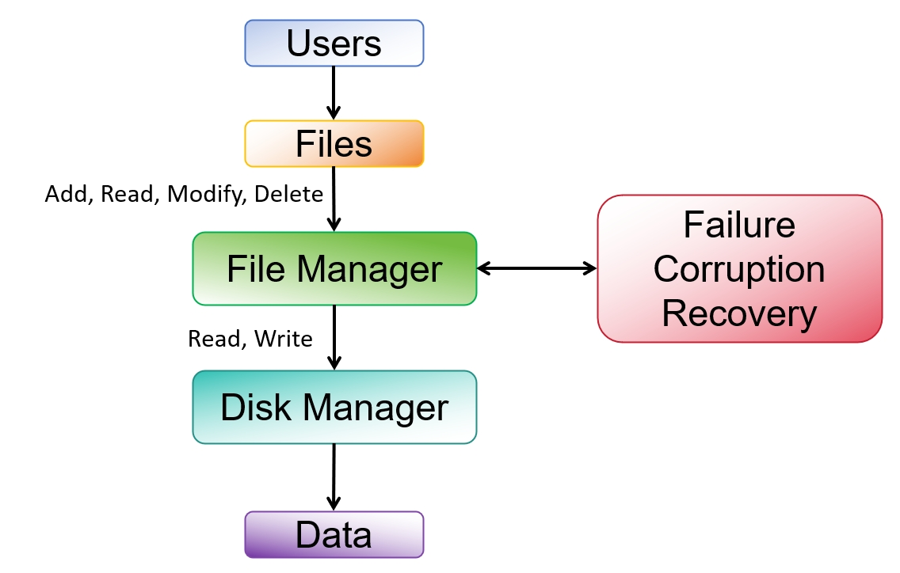
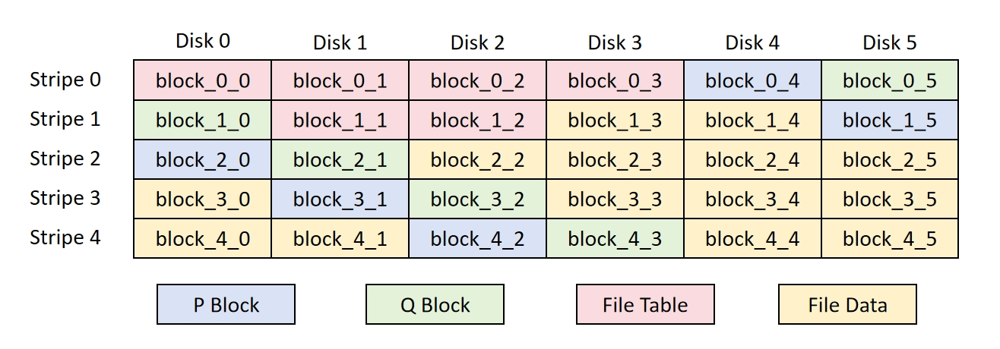

# CE7490-RAID6

## Overview
This project presents the design and implementation of a RAID6-based storage system developed using Python. RAID6 is a robust storage solution offering both redundancy and data protection against up to two simultaneous disk failures, making it ideal for large-scale storage environments. The system efficiently handles data storage, retrieval, and recovery, ensuring data integrity even in the event of disk failures.

The system operates in a seamless and coordinated manner, with each component performing its designated tasks efficiently. Upon receiving a file operation request from a user, the **FileManager** validates the request and initiates the necessary I/O operations through **DiskManager**. Throughout the process, **FileManager** continuously monitors the health of the disks and, upon detecting any issues, triggers recovery mechanisms using **GaloisField** operations.

## Key Features
1. **Accurate Data Storage and Retrieval**  
   Ensures reliable access to information with precise storage and retrieval mechanisms.
   
2. **Lost Block Detection**  
   Incorporates a mechanism to detect lost or corrupted storage blocks, safeguarding data integrity.

3. **Block Reconstruction with Galois Field (GF) Operations**  
   Uses Galois field arithmetic to reconstruct lost or damaged blocks, providing resilience against up to two simultaneous disk failures.

4. **Variable-Sized File Storage**  
   Supports flexible file management by enabling storage of variable-sized files.

5. **Consistency During Modifications**  
   Guarantees file consistency and integrity during data modifications, preventing corruption or data loss.

6. **Scalability to Large Configurations**  
   Supports up to 255+2 disk configurations, allowing the system to scale to meet the demands of extensive storage environments.

7. **Computational Efficiency**  
   Optimized with a table-based mechanism to record intermediate results for Galois field calculations, improving computational efficiency during data recovery and storage operations.

## Block Arrangement of the System
In accordance with the RAID6 design, files are divided into multiple blocks, which are distributed across different disks. To ensure balanced fault tolerance, parity blocks are also distributed among different disks rather than being stored on dedicated parity disks. 

The block arrangement structure is depicted in the following diagram. Each column represents a single disk, and the blocks in each row form a **stripe**. Every file includes a **header** and **data**. The headers are consolidated into a **file directory table**, occupying the initial blocks of the file system. This table contains essential metadata such as the file name, size, and location of the file’s data blocks.

The directory table consists of:
- **20 bytes** for the file name
- **4-byte integer** for the file size
- **Two 4-byte integers** for disk index and block index (stripe index) of the first data block

Each data block includes:
- **0-3 bytes** for actual data occupancy
- **4-7 bytes** for the next disk index
- **8-11 bytes** for the next block index
- **12-max bytes** for the file data

In this way, files are stored in a **linked list** format, where the file directory entry holds the basic information and the first block’s position. Each block, in turn, contains the location of the subsequent block.

